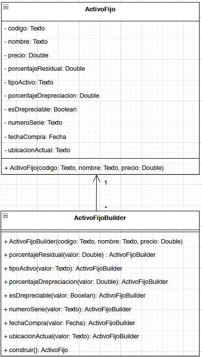
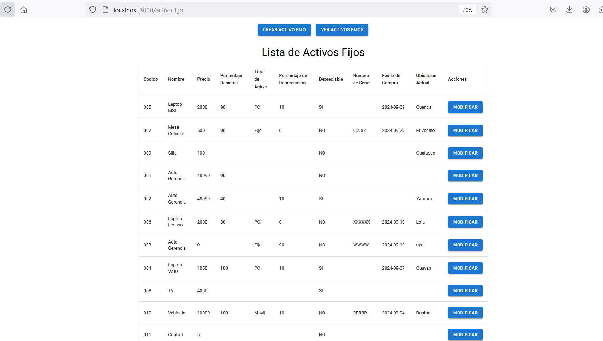
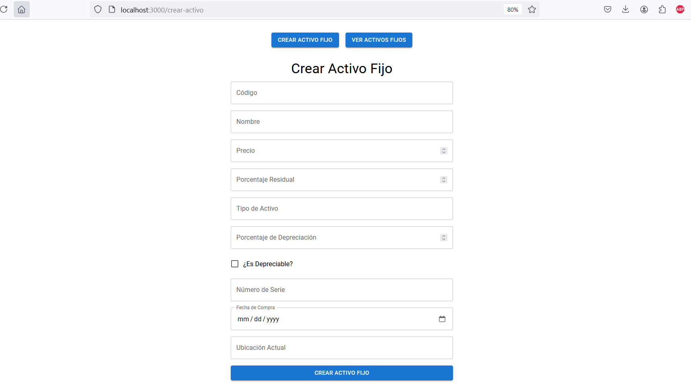
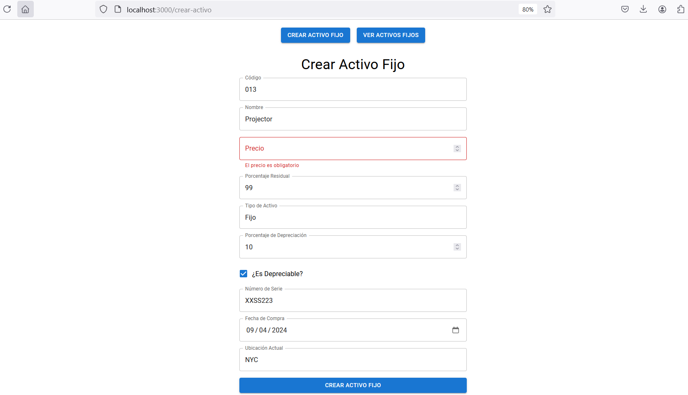
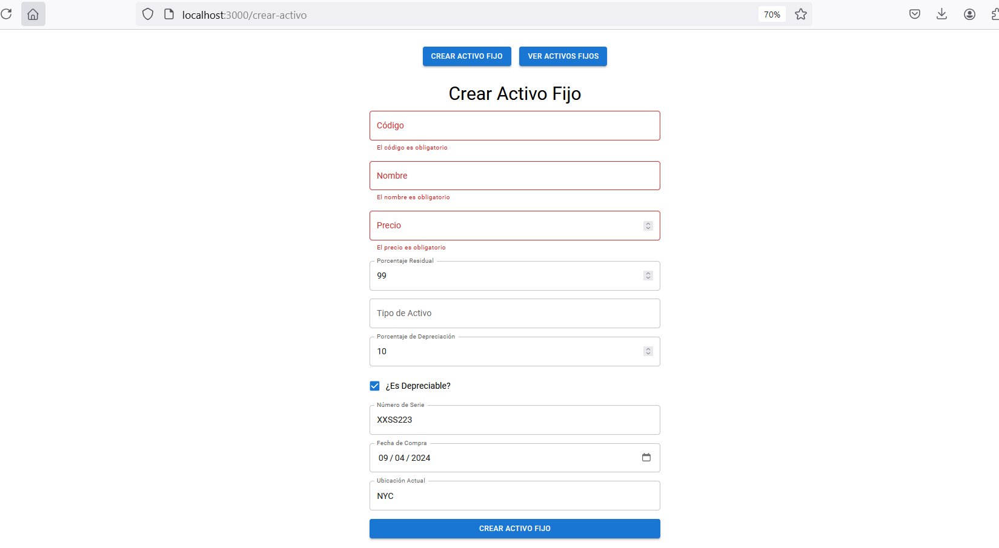
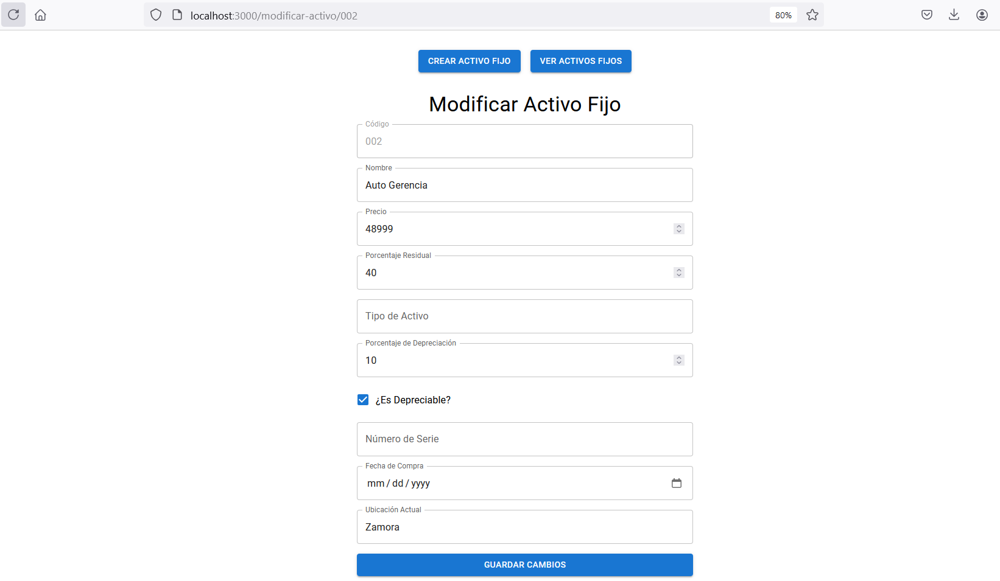
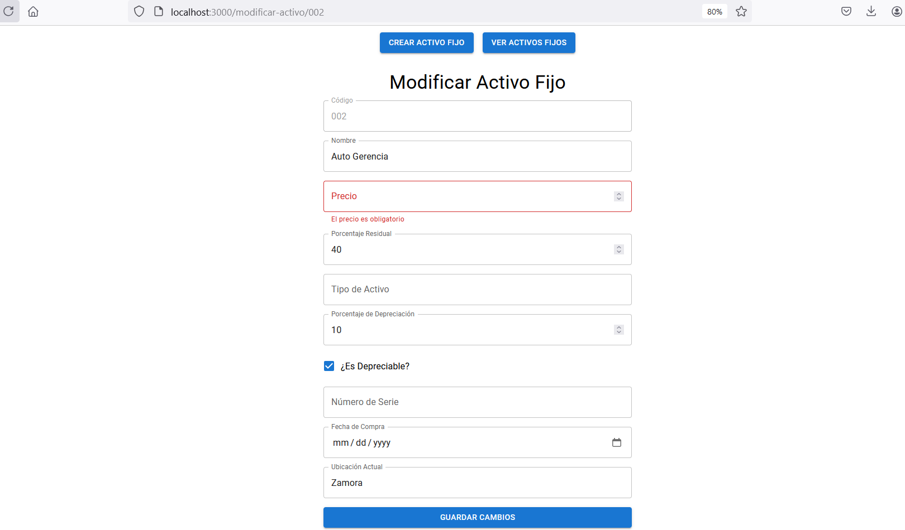

# Activo Fijo Management System

## Overview

This repository contains a full-stack application for managing Activos Fijos (Fixed Assets). The backend is implemented in Java using Spring Boot, following the Builder Design Pattern for the creation of complex objects, while the frontend is developed using React and Material-UI to create a modern and user-friendly interface for interacting with the assets.

The system allows users to:

- Create new assets (with a minimum of required fields: codigo, nombre, and precio).
- View the list of existing assets.
- Modify asset details.
- Save and persist data in a relational database using PostgreSQL.

## Project Structure

### Backend (Spring Boot)

- Controller: Manages HTTP requests for the application.
    - ActivoFijoController: Handles the endpoints for CRUD operations on Activos Fijos.

- DTO (Data Transfer Object): Represents the data objects used for communication between layers.
    - ActivoFijoDto: Data object passed between the service and controller layers.

- Entity: Represents the business objects stored in the database.
    - ActivoFijoEntity: Entity class that maps to the database table for Activos Fijos.

- Service: Contains the business logic of the application.
    - ActivoFijoServiceImpl: Implements the service layer, providing the logic to handle business processes.

- Repository: Handles the persistence and retrieval of data from the PostgreSQL database.
    - ActivoFijoRepository: Extends JpaRepository to provide standard CRUD operations.

- Builder Pattern: Implements the creational design pattern used for building complex objects like ActivoFijo in a more readable and maintainable way.
    - ActivoFijoBuilder: Used to build ActivoFijo objects step-by-step, with optional attributes.

- Database Migration: SQL scripts for database versioning and migrations.
    - V2_Builder.sql: Create the initial table structure and add fields for Activos Fijos.


### Frontend (React + Material-UI)

The frontend is implemented using React with Material-UI components for a modern and responsive interface.

- Components:
    - ActivoFijoForm.js: A form for creating new assets. Validates that codigo, nombre, and precio are not empty.
    - ModificarActivoFijo.js: A form that allows users to edit an existing asset. Similar validations are enforced.
    - ActivoFijoList.js: Displays a list of assets with a button to modify each asset.
- Routing: The application uses React Router for navigating between the asset list, asset creation form, and modification form.
    - Routes:
        - /crear-activo: Form to create a new asset.
        - /modificar-activo/:codigo: Form to modify an existing asset.
        - /activo-fijo: Displays the list of assets.

## Class Diagram

The class diagram shows the relationship between ActivoFijo and ActivoFijoBuilder, illustrating the use of the Builder Pattern to construct complex ActivoFijo objects.

<p align="center">
    
</p>

## Backend Design

The backend structure is as follows:

```
src/main/java/ec/edu/ups/pds/
├── controller
│   └── ActivoFijoController.java
├── dto
│   └── ActivoFijoDto.java
├── entity
│   └── ActivoFijoEntity.java
├── mapper
│   └── ActivoFijoMapper.java
├── repository
│   └── ActivoFijoRepository.java
├── service
│   ├── IActivoFijoService.java
│   └── impl
│       └── ActivoFijoServiceImpl.java
├── modelo
│   └── builder
│       └── ActivoFijoBuilder.java
```
### Key Backend Design Points:

- Builder Pattern: The Builder pattern is used for creating ActivoFijo objects. The ActivoFijoBuilder allows for step-by-step construction, making the code more flexible and easier to maintain when handling optional parameters.
- Repository Pattern: The ActivoFijoRepository interacts with the PostgreSQL database, handling the persistence and retrieval of Activo Fijo data.

## API Endpoints

- Create Asset: POST /activo-fijo
    - Example payload:
    ```
    {
  "codigo": "001",
  "nombre": "Laptop",
  "precio": 1200.50,
  "porcentajeResidual": 90,
  "tipoActivo": 'Fijo',
  "porcentajeDepreciacion": 10.0,
  "esDepreciable": true,
  "numeroSerie": "CTTRRR12"
  "fechaCompra": "2024-09-17",
  "ubicacionActual": "Main Office, Cuenca"
    }

    ```
- List Assets: GET /activo-fijo

- Update Asset: POST /activo-fijo

## Screenshots

### Asset List View

<p align="center">
    
</p>

### Asset Creation Form

<p align="center">
    
</p>
<p align="center">
    
</p>
<p align="center">
    
</p>

### Asset Modification Form

<p align="center">
    
</p>
<p align="center">
    
</p>

## Conclusion

This project demonstrates how to implement a Builder Pattern for creating objects with many optional parameters, and integrates a clean architecture with Spring Boot for the backend and React for the frontend. It is a scalable and flexible system that can be easily extended with more functionality.